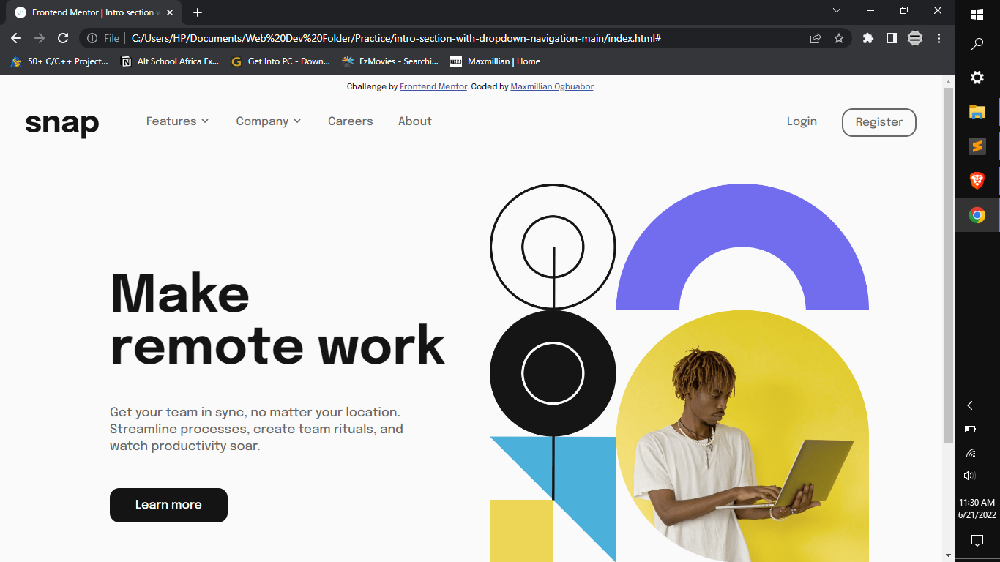

# Frontend Mentor - Intro section with dropdown navigation solution

This is a solution to the [Intro section with dropdown navigation challenge on Frontend Mentor](https://www.frontendmentor.io/challenges/intro-section-with-dropdown-navigation-ryaPetHE5). Frontend Mentor challenges help you improve your coding skills by building realistic projects. 

## Table of contents

- [Overview](#overview)
  - [The challenge](#the-challenge)
  - [Screenshot](#screenshot)
  - [Links](#links)
- [My process](#my-process)
  - [Built with](#built-with)
  - [What I learned](#what-i-learned)
  - [Continued development](#continued-development)
  - [Useful resources](#useful-resources)
- [Author](#author)

## Overview

### The challenge

Users should be able to:

- View the relevant dropdown menus on desktop and mobile when interacting with the navigation links
- View the optimal layout for the content depending on their device's screen size
- See hover states for all interactive elements on the page

### Screenshot



### Links

- Solution URL: (https://github.com/MaxKolbe/Intro-section-with-dropdown-navigation)
- Live Site URL: (https://c1h2i3d4i5.github.io/Intro-section-with-dropdown-navigation/)

## My process

### Built with

- Semantic HTML5 markup
- CSS custom properties
- Flexbox
- Mobile-first workflow
- Javascript

### What I learned

I learnt a lot of useful Javascript code, especially the ones to open and close menus and dropdown menus. Also more html and css for the first time. 
In more detail:
- To change the src of an image for particular screen sizes use "content: url("")" in the style sheet
- Opacity property takes values between 0 and 1 

```css
.col-2 img{
    content: url("./images/image-hero-mobile.png");
  }
```
```js
function dropDownFeatures() {
    if (features.style.display == "none") {
      features.style.display = "block"
      arrow.src = "./images/icon-arrow-up.svg"
    } else{
      features.style.display = "none"
      arrow.src = "./images/icon-arrow-down.svg"
    }
  }
```
  The css is to change an image's src depending on screen width and the latter is a Javascript function to drop down the drop down menu

### Continued development

There are certainly a lot of bugs I found that were results of the changing screen size. I hope to get better at media querys to sort these out.

### Useful resources

- [Grepper](https://www.codegrepper.com/code-examples/css/how+to+change+image+based+on+screen+size) - This helped me find useful code to change an image's src depending on screen size

## Author

- Website - [Maxmillian](https://max-kolbe.maximilianogbua.repl.co/)
- Twitter - [@kolbe_sama](https://twitter.com/Kolbe_sama)

